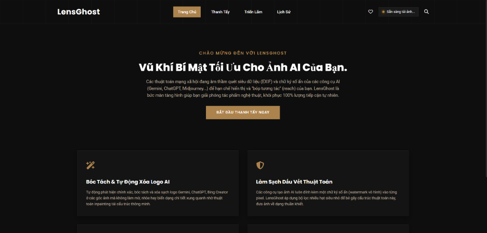
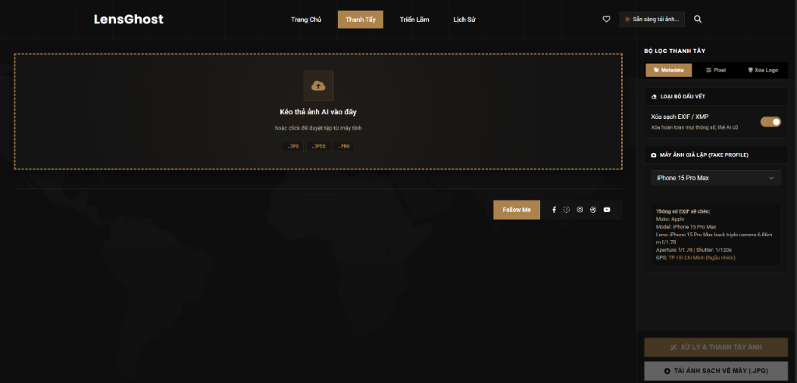

# 👻 LensGhost - Giải Thoát Ảnh AI & Chống Bóp Tương Tác

[**LensGhost**](https://lensghost-tool.web.app) là vũ khí tàng hình tối thượng dành cho các nhà sáng tạo nội dung nghệ thuật số (Digital Artists), nhiếp ảnh gia và người dùng mạng xã hội. 

Ứng dụng giúp bạn tự động loại bỏ logo AI, bẻ gãy chữ ký số ẩn, giả lập thông số máy ảnh vật lý chuyên nghiệp (EXIF/GPS) để đưa ảnh trở về trạng thái "thuần khiết" như chụp từ máy cơ, khôi phục và tối ưu hóa 100% lượt tiếp cận (reach) tự nhiên trên các nền tảng mạng xã hội (Facebook, Instagram, TikTok, Zalo, v.v.).

---

## 🔗 Liên Kết Trực Tiếp
* **Trang chủ ứng dụng:** [https://lensghost-tool.web.app](https://lensghost-tool.web.app)
* **GitHub Repository:** [https://github.com/MinhHK68/LensGhost](https://github.com/MinhHK68/LensGhost)

---

## 🎨 Giao Diện Ứng Dụng (Exhibition Art Gallery)

Dưới đây là hình ảnh thực tế về giao diện của LensGhost, được thiết kế theo phong cách phòng trưng bày nghệ thuật sang trọng (Charcoal Dark & Gold Accent) dựa trên theme WordPress Artist Art Gallery:

### 1. Trang Chủ / Landing Page Thu Hút

### 2. Giao Diện Xử Lý Canvas & Bộ Lọc Thanh Tẩy

---

## 🔥 Các Tính Năng Vượt Trội

### 1. Bóc Tách & Tự Động Xóa Logo/Watermark AI
* **Tự động hóa:** Phát hiện thông minh và tự động tẩy sạch các logo AI đặc trưng (như Gemini ở góc phải dưới) mà không làm biến dạng các chi tiết xung quanh.
* **Thủ công:** Tích hợp cọ vẽ thông minh (Inpaint brush) màu đỏ nổi bật giúp bạn khoanh vùng và xóa bỏ chính xác bất kỳ watermark, văn bản, hoặc vật thể thừa nào trên ảnh.

### 2. Bẻ Gãy Chữ Ký Số Vô Hình (Invisible AI Watermarks)
* Các mô hình tạo ảnh AI (như Midjourney, Stable Diffusion, DALL-E 3) luôn gắn một chữ ký số ẩn sâu trong cấu trúc pixel để robot kiểm duyệt nhận diện.
* LensGhost cung cấp bộ lọc **Nhiễu hạt film (Film Grain)** và **Làm mềm rìa (Soften Edge)** để bẻ gãy kết cấu pixel thuật toán này mà vẫn giữ nguyên chất lượng thẩm mỹ cho ảnh.

### 3. Giả Lập EXIF & Vị Trí Địa Lý (GPS) Vật Lý
* Xóa sạch các thẻ siêu dữ liệu cũ (XMP, EXIF, IPTC) chứa thông tin phần mềm thiết kế AI.
* Bơm ngược hồ sơ máy ảnh vật lý cực kỳ chi tiết bao gồm hãng sản xuất, dòng máy, ống kính, khẩu độ, tốc độ màn trập từ các cấu hình cao cấp:
  * **iPhone 15 Pro Max**
  * **Sony A7 IV**
  * **Canon EOS R5**
* Tự động chèn tọa độ GPS ngẫu nhiên tại Việt Nam (Hà Nội, TP. Hồ Chí Minh, Đà Nẵng...) để đánh lừa hoàn toàn các robot quét vị trí của Facebook/TikTok.

### 4. Bảo Mật Tuyệt Đối (Offline 100% Client-Side)
* Mọi tác vụ xử lý ảnh đều diễn ra trực tiếp ngay trên trình duyệt máy tính của bạn. **Không có bất kỳ dữ liệu hình ảnh nào được tải lên máy chủ**.
* Tích hợp Content Security Policy (CSP) cực kỳ nghiêm ngặt với thuộc tính `connect-src 'none'` cấm hoàn toàn mọi kết nối mạng từ mã độc, đảm bảo thông tin và tác phẩm của bạn được bảo vệ tuyệt đối.

---

## 🛠️ Công Nghệ Sử Dụng
* **Frontend:** HTML5, Vanilla CSS3 (Custom Typography, Glassmorphism, Micro-animations).
* **Core Logic:** Pure JavaScript (đã được làm rối mã nguồn `app.min.js` để bảo vệ tài sản trí tuệ và chống sao chép).
* **Dependencies:** Chạy hoàn toàn cục bộ 100% không qua CDN trung gian:
  * [exif.js](assets/js/exif.js) (Đọc siêu dữ liệu)
  * [piexif.min.js](assets/js/piexif.min.js) (Ghi và chỉnh sửa siêu dữ liệu nhị phân)
  * [fontawesome.min.js](assets/js/fontawesome.min.js) (Hệ thống icon offline)

---

## 🚀 Hướng Dẫn Sử Dụng
1. Truy cập [lensghost-tool.web.app](https://lensghost-tool.web.app).
2. Nhấn nút **Bắt Đầu Thanh Tẩy Ngay** trên trang chủ.
3. Kéo thả một hoặc nhiều ảnh vào khu vực **Submit Frame** hoặc bấm để duyệt tệp.
4. Điều chỉnh bộ lọc ở bảng điều khiển bên phải:
   * Chọn cấu hình máy ảnh giả lập muốn chèn (Ví dụ: *Sony A7 IV*).
   * Kéo thanh trượt để thêm lượng *Nhiễu hạt film* mong muốn.
   * Kích hoạt *Cọ vẽ xóa logo* và tô đỏ lên vùng chứa watermark trên ảnh gốc (nếu có).
5. Nhấn **Xử lý & Thanh tẩy ảnh** và đợi trong giây lát.
6. Bấm **Tải ảnh sạch về máy (.JPG)** để lưu bức ảnh đã được bảo vệ.
7. Đăng tải tự tin lên mạng xã hội và tận hưởng lượng tương tác tối đa!
